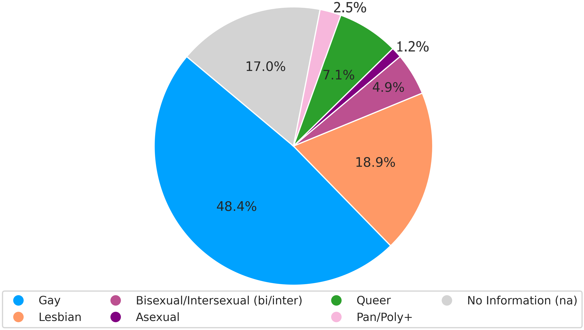
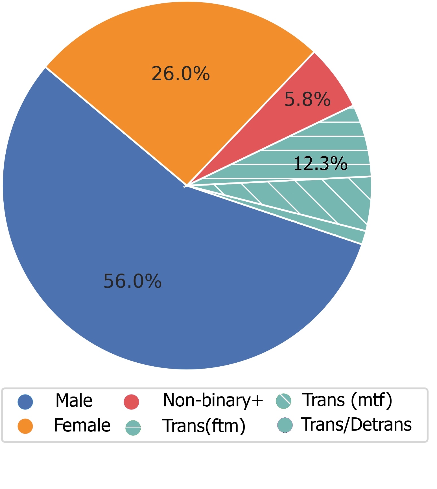
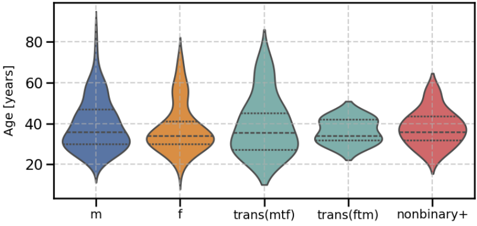
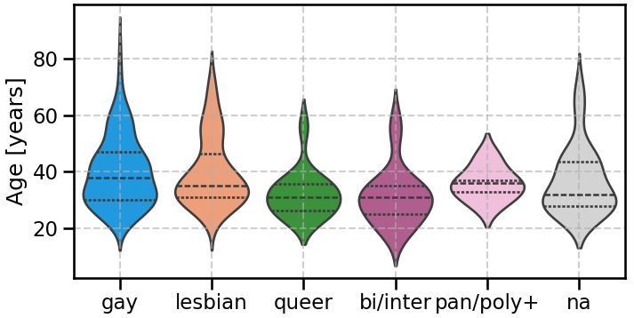
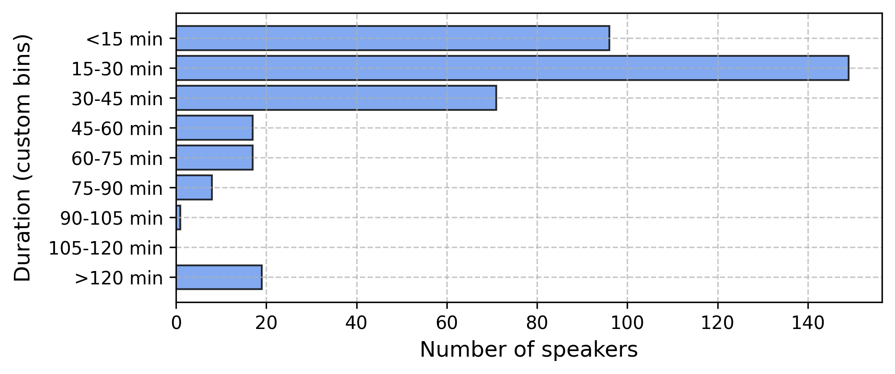

# 🏳️‍🌈 About Queer Waves

**Queer Waves** is a German speech dataset designed to support the development of equitable and inclusive speech technologies. It features approximately **335 hours of spontaneous speech** from over **400 self-identified LGBTQIA+ speakers**, collected from podcasts and YouTube content. The dataset spans a wide range of **gender identities, sexual orientations, ages (18–86) from speakers all over Germany and Austria**. 

The data collection a strong emphasis on **ethical and legal safeguards**, especially in handling sensitive personal data. By expanding the diversity of voices in speech technology, Queer Waves contributes to building **fairer and more representative AI systems**.

 The accompanying paper will be presented at [Interspeech 2025](https://www.interspeech2025.org/home).

## 📊 Dataset Statistics

- **Total Audio**: 335 hours
- **Speakers**: 400+
- **Episodes**: 486
- **Languages**: German (main)

Below you find visual insights into the distribution of gender identities, sexual orientations, speaker age, and episode durations in the Queer Waves dataset.

<div style="display: flex; gap: 2%; flex-wrap: wrap; justify-content: space-between;">

  <div style="flex: 0 0 48%;">
    <h4>Gender Identity Distribution</h4>
    
  </div>

  <div style="flex: 0 0 48%;">
    <h4>Sexual Orientation Distribution</h4>
    
  </div>

  <div style="flex: 0 0 48%; margin-top: 20px;">
    <h4>Age Range of Speakers regarding gender identification</h4>
    
  </div>

  <div style="flex: 0 0 48%; margin-top: 20px;">
    <h4>Age Range of Speakers regarding sexual orientation</h4>
    
  </div>

  <div style="flex: 0 0 48%; margin-top: 20px;">
    <h4>Distribution of amount of material per speaker</h4>
    
  </div>

</div>


## 🎙️ Podcast and Youtube Sources
The following podcasts were included in the creation of the Queer Waves dataset. Where noted, only episodes up to a specific date were used. All content was carefully selected for linguistic and identity diversity and features self-identified LGBTQIA+ speakers.

[📄 **View Detailed Podcast Overview**](podcasts.html) - Click here for comprehensive information about all included podcasts including covers, descriptions, episode counts, and more.

| **Podcast Title**                             | **Selection Status**      |
|----------------------------------------------|----------------------------|
| Auf eine Tüte                                | Complete                   |
| BBQ – Der Black Brown Queere Podcast         | Complete                   |
| 030 Bootycall                                 | Until 2024-08-28           |
| Böttinger Wohnung 17                          | Complete                   |
| Hotel Matze                                   | Until 2024-11-20           |
| Out and About                                 | Complete                   |
| Queer as Berlin                               | Complete                   |
| Queerkram                                     | Complete           |
| Reden ist Gold                                | Complete                   |
| Somewhere Over The Hay Bale                   | Complete                   |
| SPUTNIK Pride                                 | Until 2024-11-08           |
| Willkommen im Club                            | Until 2024-11-20           |

> Dates reflect the latest episode included from each feed at the time of dataset extraction.

## 🔧 Processing Pipeline
- **Collection**: Curated podcast selection using [podcast-dl](https://github.com/lightpohl/podcast-dl)
- **Preprocessing**: Format conversion and segmentation
- **Transcription**: OpenAI Whisper
- **Diarization**: Speaker segmentation (1–4 speakers)
- **Annotation**: Sexual Orientation, Gender Identity, Age and Region based on self-identification
- **Validation**: Manual spot checks and metadata curation

## 📂 Available Data
We provide:
- Podcast and episode metadata (JSON)
- Annotation scheme (Gender identity, sexual orientation, age, speaker region)
- Automatic Processing Pipeline descripion + scripts(if available)
- Example transcripts (JSON)
- Metadata overview
- Documentation

> ⚠️ The full dataset is only available **on request** for non-commercial academic use.

## 📝 Sample Entry
```json
{
  "episode_id": "ep_045",
  "title": "Queer Voices in Berlin",
  "speakers": [
    {
      "id": "spk_01",
      "gender": "non-binary",
      "segments": [
        {
          "start": "00:00:05",
          "end": "00:02:15",
          "transcript": "Welcome to our discussion on queer identities..."
        }
      ]
    }
  ]
}
```

## 📥 How to Get the Data
1. Contact us: [ingo.siegert@ovgu.de](mailto:ingo.siegert@ovgu.de)
2. Describe your academic use case
3. Sign the [Data Usage Agreement](docs/license.md)
4. Receive access credentials

## � Suggest a Podcast
Do you know of a German-language podcast featuring LGBTQIA+ voices that could enrich the Queer Waves dataset? We welcome suggestions for new podcast sources! Please send us your recommendations with the following information:

[📧 **Suggest a Podcast**](mailto:ingo.siegert@ovgu.de?subject=Podcast%20Suggestion%20for%20Queer%20Waves%20Dataset&body=Dear%20Queer%20Waves%20Team%2C%0A%0AI%20would%20like%20to%20suggest%20a%20podcast%20for%20inclusion%20in%20the%20Queer%20Waves%20dataset%3A%0A%0ATitle%3A%20%0AShort%20description%3A%20%0AWebpage%3A%20%0ARSS-Feed-Link%3A%20%0A%0A%0A%0ABest%20regards%2C)

**Required Information:**
- **Title:** The name of the podcast
- **Brief Description:** Short description of the content and speakers
- **Webpage:** Official website or platform link
- **RSS Feed Link:** Direct link to the RSS feed *(essential for processing)*

> ⚠️ **Important**: Without an RSS feed link, podcasts cannot be processed and included in the dataset.

## �📄 License
- Website & Documentation: **CC BY-NC 4.0**
- Dataset: Available only under a **research-only usage agreement**

## 📚 How to Cite
> Siegert, I., Marquenie, J., & Grawunder, S. (2025). Queer Waves: A German Speech Dataset Capturing Gender and Sexual Diversity from Podcasts and YouTube. Interspeech 2025
> Siegert, I., Marquenie, J., & Grawunder, S. (2025). Queer Waves: A German Speech Dataset Capturing Gender and Sexual Diversity from Podcasts and YouTube, Dataset. 10.5281/zenodo.15561004


## 👥 Authors
- **Ingo Siegert** 
- **Jan Marquenie** 
- **Sven Grawunder**
