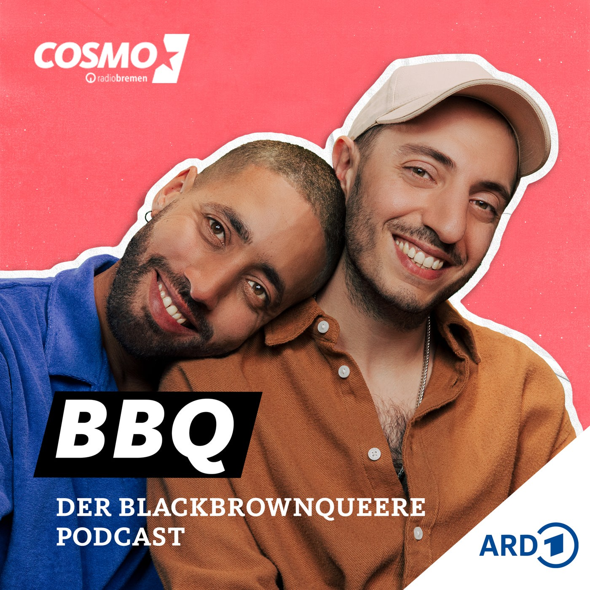
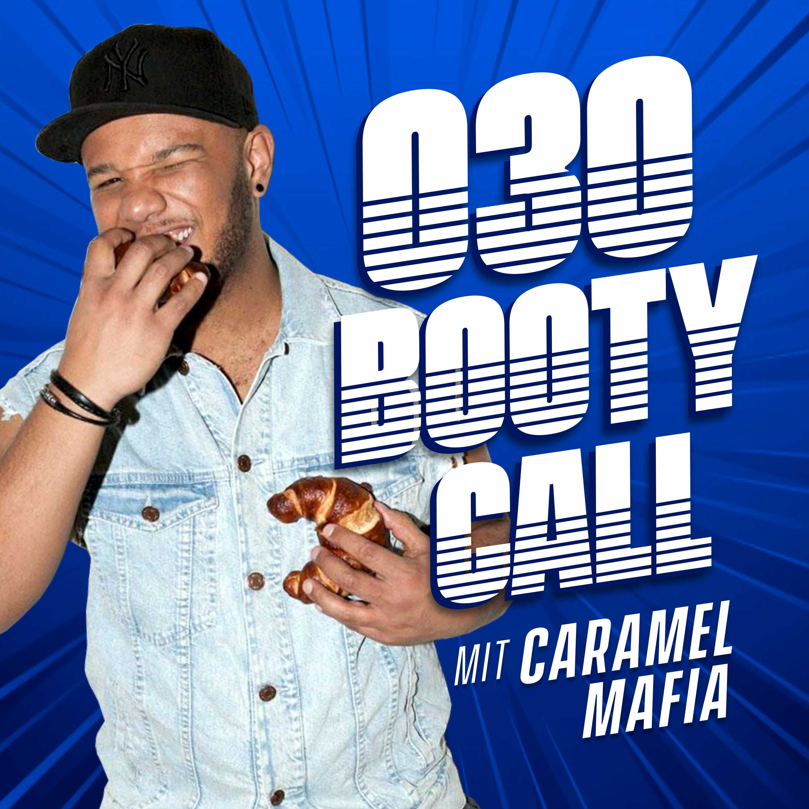
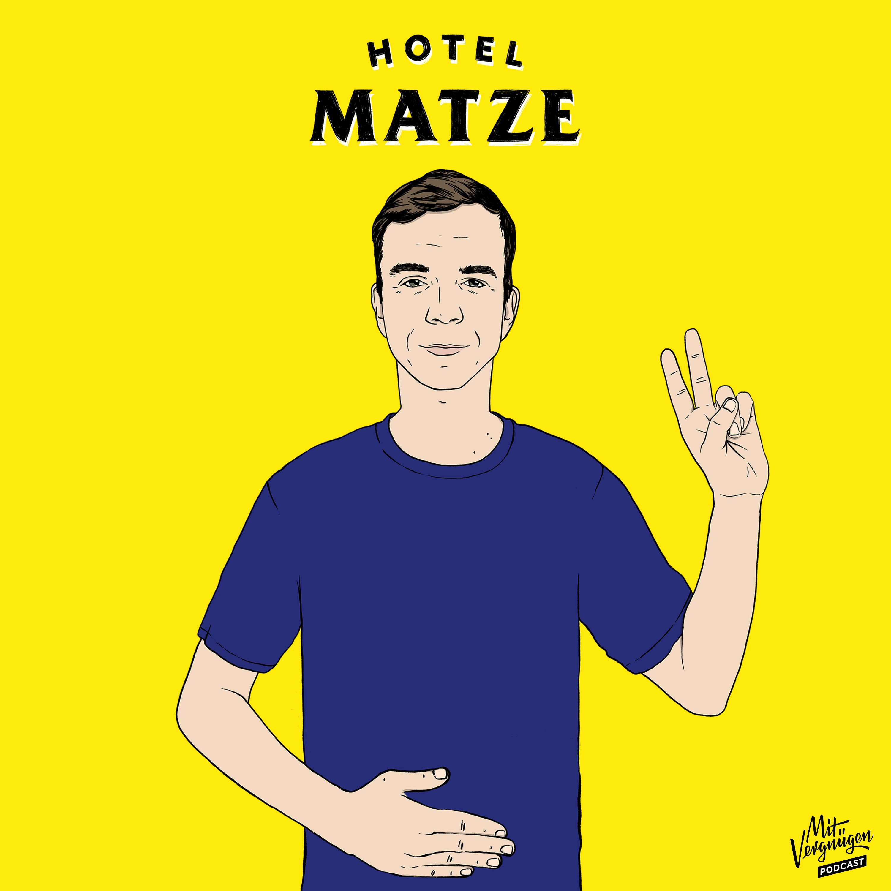
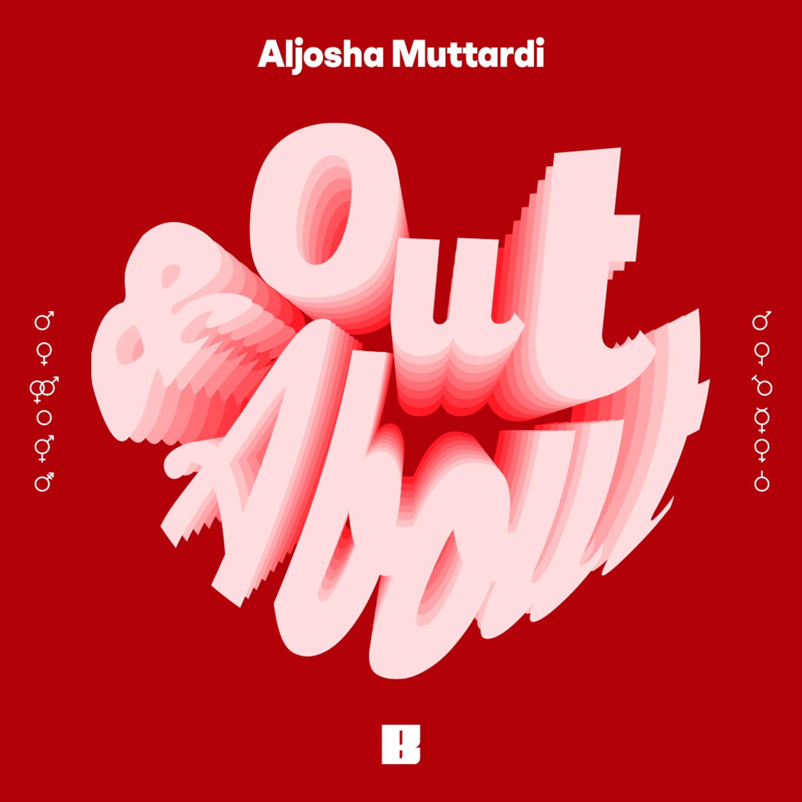
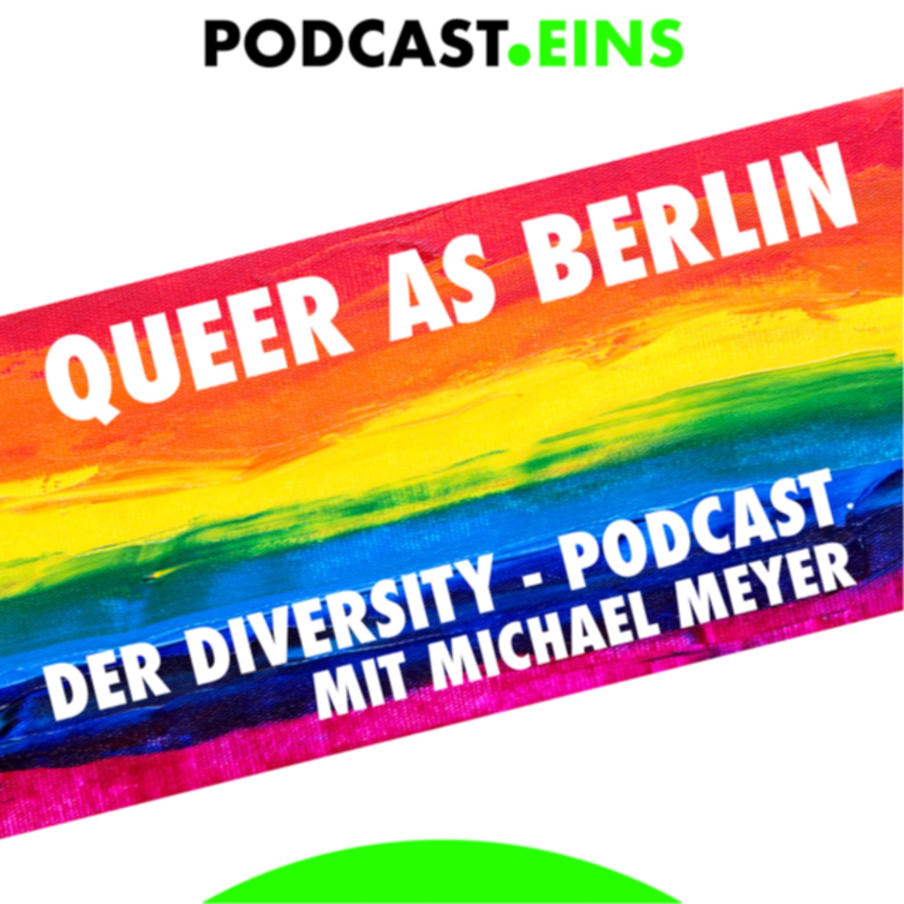
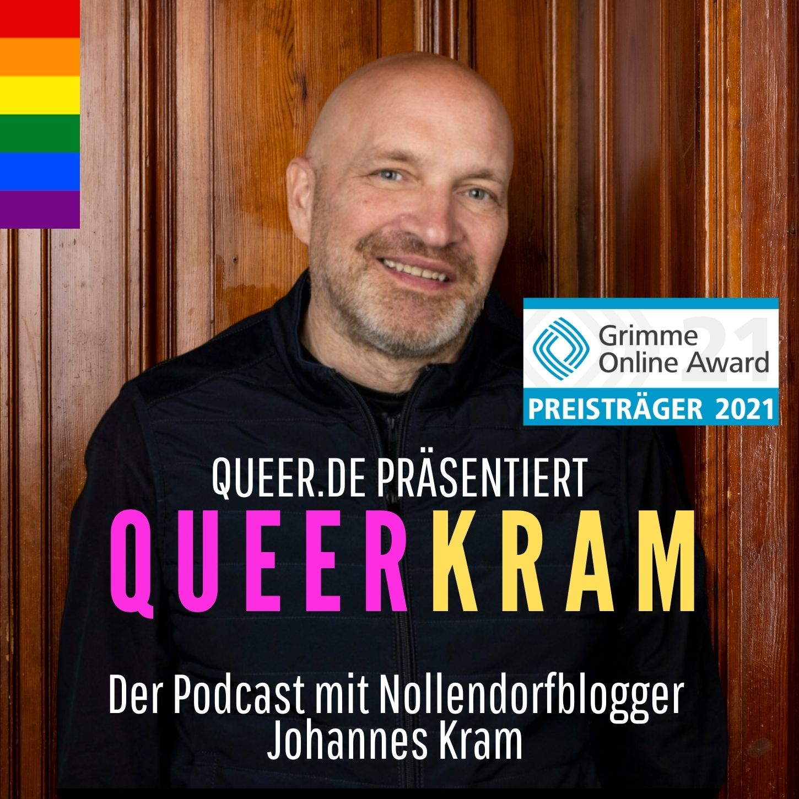
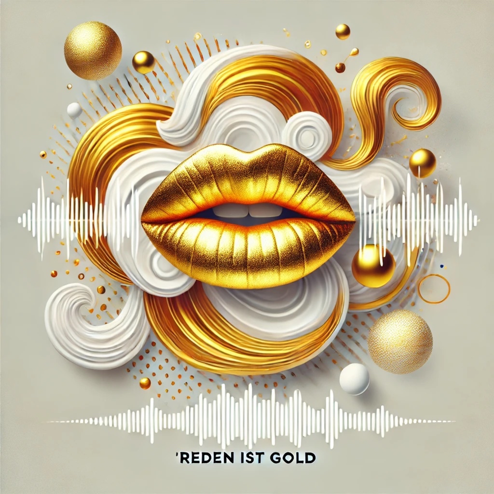
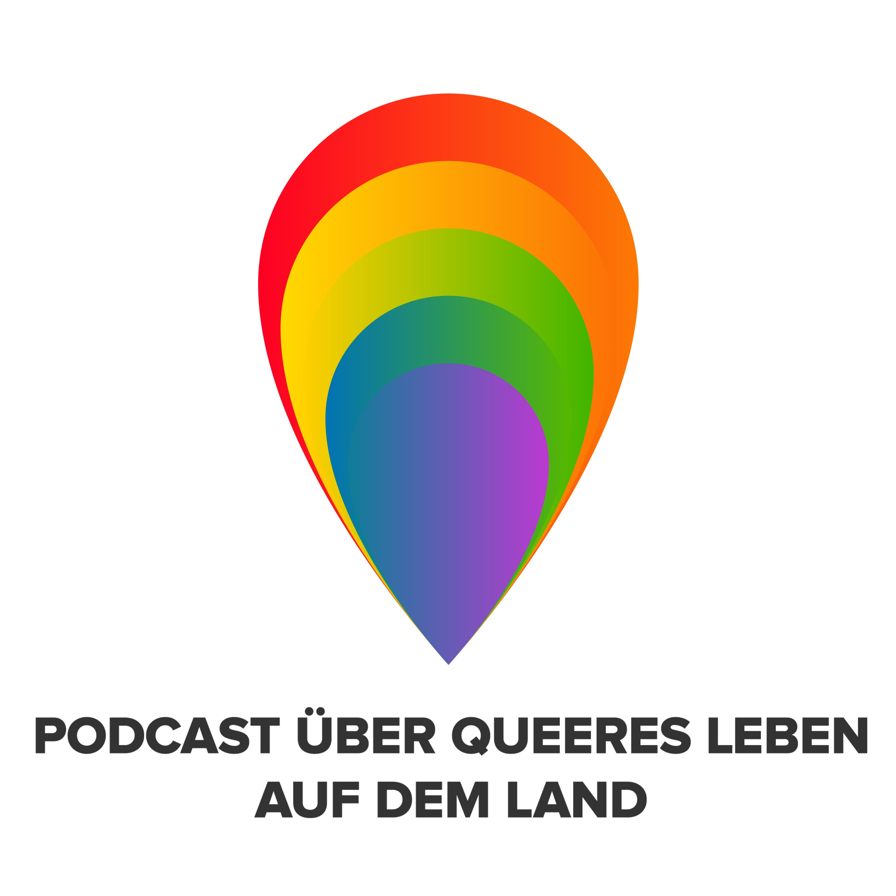
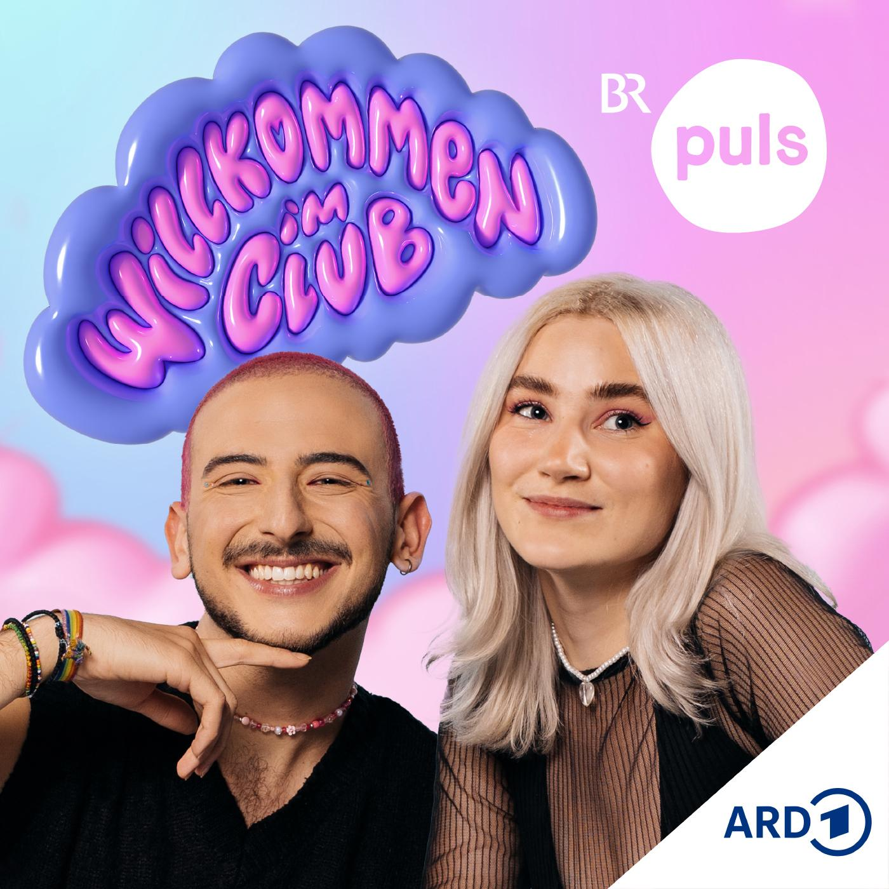

<a href="index.html" class="back-link">← Back to Dataset Overview</a>

# 🎙️ Detailed Podcast Overview

<h2>Included Podcasts Summary</h2>

12

Total Podcasts

1,064

Total Episodes

12

Successfully Loaded

0

Feed Errors

<h3>Auf eine Tüte</h3>

Hengameh

Let's talk about bags, baby! In diesem Potcast heißt es: Abhängen mit der High Society. Jede Folge trifft Hengameh eine beeindruckende Person aus Popkultur und Politik auf eine Tüte. Den Inhalt dieser Tüte bringen die Gäste mit, schließlich packen sie aus ihrem Innersten aus. Welchen Emotional Ba...

Episodes:
61

Category:
Unbekannt

Start Date:
18.04.2020

End Date:
28.11.2021

Language:
de

Base Name:
Auf eine Tüte

<h3>BBQ – Der Black Brown Queere Podcast von COSMO</h3>

COSMO

Black! Brown! Queer! Mehr BIPoC und queere Perspektiven im öffentlichen Diskurs: Alle zwei Wochen besprechen die Hosts Zuher Jazmati und Dominik Djialeu Themen, die sie oder die Welt gerade bewegen.

Episodes:
66

Category:
Society & Culture

Start Date:
06.09.2022

End Date:
05.12.2024

Language:
de

Base Name:
BBQ – Der Black Brown Queere Podcast

<h3>030-Bootycall: Der etwas andere Berlin-Dating-Podcast</h3>

030 Bootycall

Willkommen in Berlin, der Hauptstadt der Singles. In diesem Berlin-Podcast geht es ordentlich zur Sache. Gastgeber Caramel Mafia hat in jeder Folge ein spannendes Date und Ihr seid live dabei. Ganz egal ob Horrordate, Sexpanne oder vorgetäuschter Orgasmus von Männern - hier wird kein Blatt vor de...

Episodes:
41

Category:
Unbekannt

Start Date:
25.04.2019

End Date:
26.03.2025

Language:
de

Base Name:
Bootycall

<h3>Böttinger. Wohnung 17</h3>

WDR 2

Inwieweit bestimmt unser Geschlecht unsere Identität und unseren Lebensweg? Das möchte ich herausfinden. Ich bin Bettina Böttinger. Ich bin selbst queer und kämpfe für die gesellschaftliche Akzeptanz verschiedener Lebensentwürfe. In diesem Podcast lade ich Menschen zu mir nach Hause ein. Ich möch...

Episodes:
55

Category:
Society & Culture

Start Date:
27.04.2021

End Date:
29.12.2022

Language:
de

Base Name:
Böttinger Wohnung 17

<h3>Hotel Matze</h3>

Matze Hielscher & Mit Vergnügen

Das ist kein richtiges Hotel, sondern ein Interview-Podcast von Matze Hielscher. Hier treffe ich mich seit 2016 mit Menschen, die mich interessieren und versuche herauszufinden, wie die so ticken.

Episodes:
466

Category:
Unbekannt

Start Date:
26.10.2016

End Date:
09.07.2025

Language:
de

Base Name:
Hotel Matze

<h3>Out and About</h3>

Aljosha Muttardi & Studio Bummens

Was bedeutet Coming-out im Jahr 2023? Braucht es das überhaupt noch? Und wie sah das früher aus? Das und viele weitere Fragen rund um die Lebensrealitäten queerer Menschen diskutiert Host Aljosha Muttardi mit seinen Gäst*innen im neuen Format "Out and About". Die queere Community ist divers, so w...

Episodes:
12

Category:
Unbekannt

Start Date:
01.03.2023

End Date:
18.01.2024

Language:
de

Base Name:
Out-and-About

<h3>Out and About</h3>

Aljosha Muttardi & Studio Bummens

Was bedeutet Coming-out im Jahr 2023? Braucht es das überhaupt noch? Und wie sah das früher aus? Das und viele weitere Fragen rund um die Lebensrealitäten queerer Menschen diskutiert Host Aljosha Muttardi mit seinen Gäst*innen im neuen Format "Out and About". Die queere Community ist divers, so w...

Episodes:
12

Category:
Unbekannt

Start Date:
01.03.2023

End Date:
18.01.2024

Language:
de

Base Name:
Queer as Berlin

<h3>Queer As Berlin</h3>

© Michael Meyer - PODCAST EINS

Zur Show"Queer as Berlin" ist der Diversity Podcast aus der Hauptstadt, der interessante Gäste und Themen präsentiert. (Sub-) Kultur,&nbsp;Politik, Unterhaltung, Musik, Wirtschaft, Gesellschaft – alles aus der Diversity Perspektive kann hier Thema sein. In Deutschland leben ca. 8-10 Millionen sch...

Episodes:
68

Category:
Unbekannt

Start Date:
01.08.2019

End Date:
24.05.2024

Language:
de

Base Name:
Sputnik Pride

<h3>QUEERKRAM</h3>

Johannes Kram präsentiert von queer.de

Hier gibt es rund einstündige Gespräche, die der Autor Johannes Kram mit Gästen führt, die meist aus der LGBTI-Community kommen, also offen lesbisch, schwul, bi-, intersexuell oder trans sind. Unter dem Motto „Wir sind alle anders, wir sind alle gleich" möchte Kram dazu beitragen, völlig untersch...

Episodes:
43

Category:
Unbekannt

Start Date:
28.02.2020

End Date:
02.11.2024

Language:
de

Base Name:
Queerkram

<h3>Reden ist Gold</h3>

Rick und Chris

Zwei Freunde, ein Mikrofon (ehrlich gesagt sind es zwei Mikrofone),...und jede Menge Themen, die bewegen – Von mentaler Gesundheit über Fitness und Technik bis zu den Herausforderungen des Alltags. Hier erwarten euch ehrliche Gespräche, spontane Wetten und wöchentliche Challenges, die wir mit ein...

Episodes:
18

Category:
Unbekannt

Start Date:
27.10.2024

End Date:
08.06.2025

Language:
de-de

Base Name:
Reden ist Gold

<h3>Somewhere Over The Hay Bale</h3>

Fabian

Jenseits des Heuballens: Der erste deutschsprachige Interviewpodcast über queeres Leben auf dem Land. 40 Folgen aus 4 Jahren. Danke. Als schwuler Junge in einem (ostdeutschen) Dorf groß zu werden war nicht immer ganz so easy für mich. Homosexualität und queeres Leben kannte ich fast nur aus dem F...

Episodes:
43

Category:
Unbekannt

Start Date:
10.03.2020

End Date:
15.03.2024

Language:
de

Base Name:
Somewhere Over The Hay Bale

<h3>Willkommen im Club - der queere Podcast von PULS</h3>

Bayerischer Rundfunk

Willkommen im Club der LGBTIQA*-Community! Aber wer ist das eigentlich und wieso braucht sie so viele Buchstaben im Titel? Welche Klischees ärgern Lesben, Schwule, Bisexuelle, trans* und andere queere Menschen so richtig? Was beschäftigt sie gerade? Gemeinsam mit euch entdecken Sophia und Dimi, d...

Episodes:
179

Category:
Society & Culture

Start Date:
04.05.2020

End Date:
09.07.2025

Language:
de

Base Name:
Willkommen im Club

---

Generated on July 11, 2025 at 22:21 | 
<a href="index.html" style="color: #007bff;">← Return to Dataset Overview</a>

